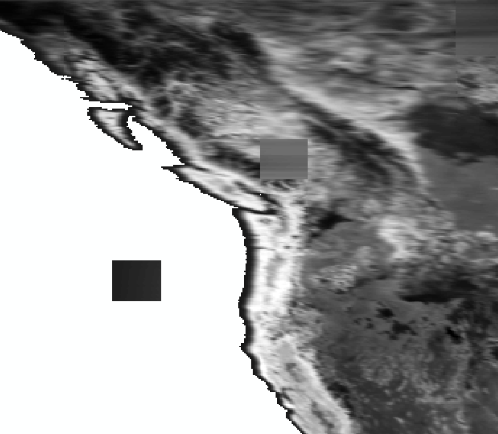

# 2025/8/25 任务安排
## 任务：植被NDVI在山区不同坡向的长势

1. 下载NDVI产品

   - 下载5个产品
   - 时序要尽量在20年以上, 18/19等年左右都可以
   - 只接受0.05°及更高分辨率的NDVI产品
   - MODIS产品必须下载
   - 处理成年尺度 --> 下载的时间尺度是在月尺度上还是直接年尺度上问一下xie --> 月尺度
   - 空间尺度 --> 统一在哪一个空间分辨率上去做？ --> 问一下xie --> 看产品多数在哪个分辨率下 ==> 大概率0.05°
   - 时间尺度 --> 对于不同的产品时间范围不一样, 是统一时间范围(取交集)还是各自的产品各自在自己的时间范围分别处理? --> 问一下xie
--> 统一时间范围

2. NDVI预处理的质量控制(处理流程需和师兄商量)

    - 所有NDVI产品、DEM和aspect等均需要对齐像元 --> 以谁为基准呢? --> DEM
    - 暂定未完

3. 高程的注意事项

    - 高程存在小于0的像元, 直接将其赋值为0
    - 对于散点图, 高程小于和等于0的像元不参与计算? --> 是否这样计算? --> 不参与计算

4. NDVI年际均值计算

   - 每一个产品都需要计算一张年际均值GeoTIFF文件(多年均值计算) --> 这里的年尺度合成是max?还是mean?或者median?
   - 每一个产品都需要计算一张年际趋势GeoTIFF文件(多年MK趋势计算) -- 可以暂缓

5. 坡向计算(处理流程需和师兄商量)
   
   - 计算东西南北坡四个坡向即可
   - 注意南北半球的坡向计算差别(翻阅博客文献等) --> 西南交大(yin gao fei, 农业气象AFM)

6. 高程-NDVI的散点图

   - 每个山区(共179个山区)每个坡向都需要一张散点图
   - 每个山区还需要一张总的散点图(不区分坡向划分)
   - 对于每个山区还需要判断是否像元数量足够, 不足建议不将xx山区纳入后续研究
   - DEM-NDVI的散点图绘制可参考之前xie给的GPP-ET碳水耦合的审稿论文
   - 散点图需要包含:

      - 散点图所用的pixel数量
      - 散点图的高程范围? --> x轴的范围吗?还是每一小段高程的范围? --> excel文件统计
      - 散点图的p值? --> 指代什么,是线性拟合的p值吗? --> excel统计+散点图标注
      - 散点图的NDVI范围? --> y轴的范围吗? --> excel统计
      - 散点图中NDVI的mean和中位数? --> 这是指代散点图的什么? --> 单个散点图所用的所有NDVI和DEM数据的mean和median
   
伪代码: 
````python
for cur_山区 in 所有山区:
    for cur_坡向 in 东西南北坡:
        # 绘制当前坡向的散点图
        pass
    # 绘制当前山区的总散点图
    pass
    # 记录当前山区各个坡向的有效像元数量, 判断是否纳入后续研究 --> excel统计
    pass
````


# 2025/8/28 任务安排和注意事项

1. 计算 `028Mountain179.xlsx` 文件中全球统共179个山区的中心经纬度、海拔均值及其标准差

>`028_SupplyTable.xlsx`已提供(xie给)全球近60个山区的中心经纬度等参数, 但对于全球总共179个山区并没有全部计算,
> 因此需要对所有山区分别计算中心经纬度等参数, 同时计算的参数与(xie)提供的中心经纬度等对比一下差异(应该
> 是使用ArcGIS计算的,或者gdal)

2. 坡向的定义(引用: 《Microclimate Driven Grassland Greenness Asymmetry Between West‐and East-Facing Slopes on the Tibetan Plateau》):

> East‐facing slopes were defined as pixels with aspects ranging from 45° to 135° and slopes exceeding 5°, while 
> west‐facing slopes corresponded to pixels with aspects between 225° and 315° and slopes greater than 5°. NDVI 
> typically mitigates most topographic influences by normalizing ratios, some deviations remain on rugged and steep 
> terrains with low solar altitude angles. To minimize such topographic impacts, pixels with slopes steeper than 25° 
> were excluded from the analysis.


# 2025/8/31 进度说明和注意事项

1. 目前已经完成下列数据集的下载(详情见./Src/download/download_log.md):

    - MOD13A3 V6.1
    - MYD13A3 V6.1
    - GIMMS NDVI 3G+
    - CLMS NDVI V3
    - NOAA CDR AVHRR NDVI V5
    - PKU GIMMS NDVI V1.2
    
    尚未完成下载的数据集是:

    - eMODIS NDVI V6(主要是USGS的M2M API批量下载权限还没有申请到)

2. 关于PKU GIMMS NDVI V1.2的趋势分析, 需要注意一些问题, 详情见: `https://zenodo.org/records/8253971`


# 2025/9/2 任务安排

1. 调研清楚东西南北坡、向极地坡和向赤道坡的定义
   - 查阅尹高飞老师的相关论文和关于坡向相关的论文
2. 编写预处理MODIS产品转Geotiff文件的代码(正弦投影转WGS84)
   - 正弦投影转WGS84
   - 镶嵌拼接
   - 重采样(1/12°)
   - hdf/nc --> tiff文件


# 2025/9/3 任务安排

1. 优化img_mosaic函数: 
   - 镶嵌范围-global
   - 镶嵌模式-mosaic mode(last, max, mean, min)
2. 优化img_warp函数
   - 无效值和输出类型参数

# 2025/9/4 异常情况

1. [mod13a3_process.py](Src/preprocessing/mod13a3_process.py)中`img_warp`函数输出的geotiff文件存在似乎是未进行投影转换的
   小方块(夹杂在大栅格矩阵中)

   


# 2025/9/7 异常情况

1. `MOD13A3`文件夹(`I:\DataHub\NDVI\MOD13A3`)在每个子文件夹开头或者结尾会出现不属于这个子文件夹时间范围内的文件;
   - 例如`mod13a3_00_03`文件夹中出现了2004年的文件
2. 检查其他文件夹或者产品的重复问题;

异常情况说明:

1. 初步判断是`DownloadManager`下载的问题, 因为原始的下载链接中不存在错位的错误(例如00_03的下载链接中并没有意外包含04年的部分链接)
2. 该异常情况的逻辑可能是因为下载中断等原因导致下载的文件和文件名错位(仅极少数)
3. 该异常情况不会影响镶嵌, 因为同一地区出现两个一摸一样的矩阵根据镶嵌的原则会求取均值因而不会造成影响,
   但是为了确保万无一失, 这里将存在多余的且异常的文件全部移除到`I:\DataHub\NDVI\MOD13A3\abnormal`
4. 其他产品没有发现这个异常情况


# 2025/9/8 数据集缺失情况-文献阅读

1. 关于数据集部分时间点/段缺失的情况(见前文log记录), 师兄建议从文献入手查看其他文献对于使用对应
   产品是如何处理缺失情况,或者即使没有阐述这种细节问题, 可以看看文献大部分使用哪一个时间段的数据集
   或许会避开某些缺失比较严重的时间段.


# 2025/9/9 数据类型不一致导致的精度问题

1. [gimms_3g_process.py](Src/preprocessing/gimms_3g_process.py)中, 我尝试将数组转换为float32, 因为精度
   太高(float64)没有必要, 但是由于valid_range(-0.3 ~ 1)的数据类型还是float64, 因此导致了在-0.3处出现了问题.
   具体问题是数组中存在相当一部分np.float32(-0.3),将其与np.float64(-0.3)比较时发现：
   `npfloat32(-0.3) < np.float64(-0.3)`是True,这就导致数组中一部分-0.3被掩膜掉了.
   这是因为浮点数精度问题, 尝试运行下方即可了解清楚情况
   ```python
   import numpy as np
   
   a1 = np.float32(-0.3)
   a2 = np.float64(-0.3)
   print('a1(float32): {:.20f}'.format(a1))
   print('a2(float64): {:.20f}'.format(a2))
   ```
   __!!! 检查一下其他文件产品是否出现了这种情况 !!!__


# 2025/9/12 如何检查预处理的结果是否正确?

1. 加载全球行政等边界, 查看预处理的结果是否能与边界对应上、是否南北极颠倒、是否东西半球互换？
2. 查看无效值是否被正确掩膜(通过ArcGIS的识别工具而非肉眼观察, 可能会存在无效值为0显示为白色);
3. 查看预处理结果的边界部分是否显示异常, 包括沿边界(关注有效值和无效值的边界特别是海陆边界)的栅格是否异常白或者异常黑边；
4. 与原始数据对比(利用Panoply、ENVI、ArcGIS/Pro等打开原始的nc/hdf/geotiff文件)观察无效值区域(无效值被正常掩膜, 
   但部分≈无效值的有效值也被掩膜)是否多出部分无效值区域(其本该是有效值的), 尤其关注中亚、撒哈拉沙漠、南北极圈区域(
   出现这种情况可能是由于数据类型不一致的约束导致mask生区域扩大或者缩小, 例如mask = np.arrary(float32) > np.float64(无效值)等)
5. 通过GIS软件观察tiff文件的地理覆盖范围, 是否不超出边(例如-180~180, -90~90)界或者边界与预想的存在微小偏差
6. 查看高纬区域特别是北美洲、亚洲靠近北极圈的区域是否存在扭曲变形, 大方块模糊等情况


# 2025/9/12 GIMMS NDVI 3G+存在的栅格边界线问题

1. 无论是原始的NC文件还是预处理的tiff文件, 都存在边界线(特别是海陆分界处的黑边), 通过GIS识别黑边的栅格值均为-0.3
   而NC文件的属性信息中显示valid_range为-0.3 ~ 1.0, 那么有效值就应该是闭区间, 因为海洋的区域栅格值为-32768.0,
   其值正好等于_FillValue,如果-0.3不应该作为无效值, 那么为什么不直接将这个-0.3区域的栅格值赋值为_FillValue。


# 2025/9/13 任务安排

1. 首先正式解决坡向的问题(和xie商量), 及其坡度、DEM等辅助数据的预处理工作(并将其作为基准数据, 所有NDVI数据统一到这一标准例如分辨率等)


# 2025/9/17 任务安排(跟xie商量过)

1. 统一覆盖范围: -60°S ~ 90°N
2. 统一分辨率： 重采样至0.08°
3. 统一时间范围: 2003.1.1 - 2019.12.31
3. 坡向的定义
   - 跟ArcGIS的定义一致, 分8个方位(`ps`其中平地-1不要, 此外注意xie给的坡向似乎是-20 ~ 3600, 放大10倍, 且存在-10和-20<了解一下这两个>)
   - 此外再次确认slope=0是否就是aspect为平地的时候(应该不是)
   - 均值合成这一块要详细看一看, 首先是原始分辨率 --> 月尺度 --> 年尺度 --> 年际尺度

         现在年尺度 --> 年际尺度毫无疑问就是mean聚合(xie已经明确), 但是月尺度 --> 年尺度以及原始分辨率(例每天) --> 月尺度这些聚合方式
         是什么。建议查看北师大-陈晋，朱孝林(陈的学生)，电子科大-曹尹(陈的学生)
   - 5°slope这个先加上, 但是后面yin不一定对, 多以留一个后门
   - 3 - 5个区域， 安第斯山脉, 青藏高原, 横断山脉